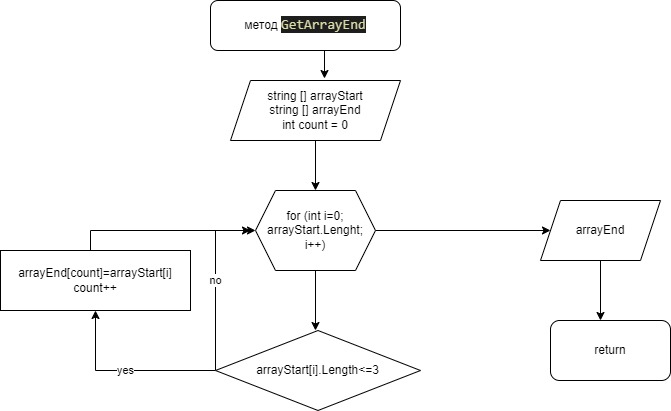

## Написать программу, которая из имеющегося массива строк формирует массив из строк, длина которых меньше либо равна 3 символа.
### Первоначальный массив можно ввести с клавиатуры, либо задать на старте выполнения алгоритма.
### При решение не рекомендуется пользоваться коллекциями, лучше обойтись исключительно массивами

1. создал метод создания массива, сотоящего из элементов исходного массива с длиной меньше или равно 3
2. создал метод, выводящий массив на печать
3. добавил jpg Блок-схема

